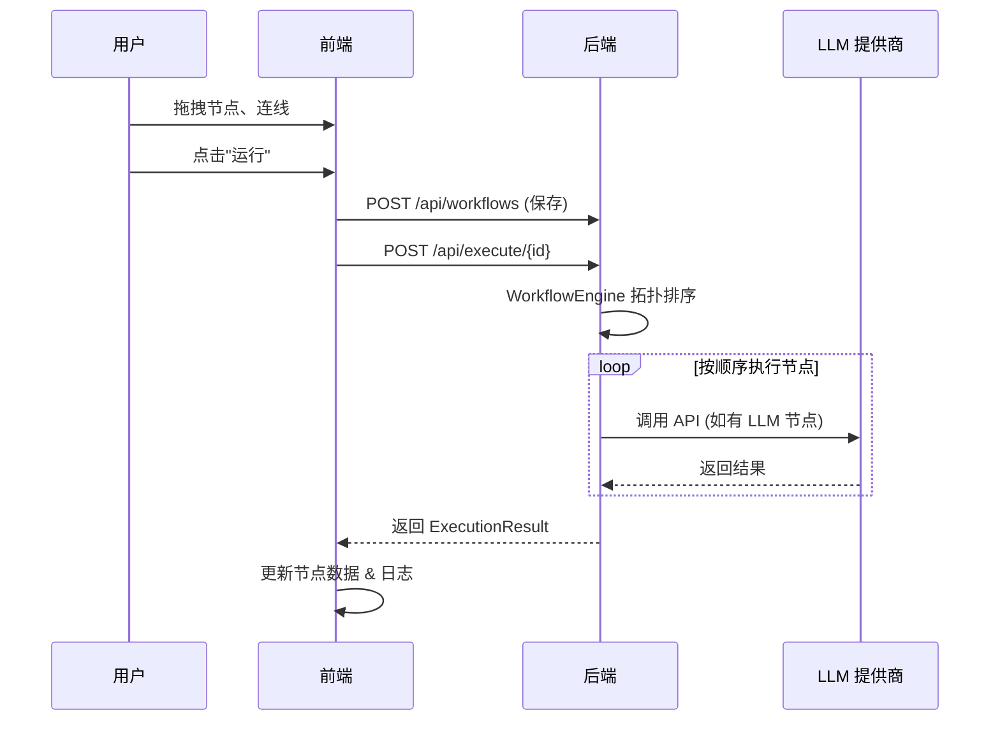

# 项目结构：Sekhmet 节点式 LLM 工作流平台

本设计方案基于 **Spring Boot (后端)** 和 **Vue 3 + Vue Flow (前端)**，构建了一个类似 ComfyUI 的节点式 LLM 工作流编排系统。

## 1. 顶层目录结构

采用 Monorepo 风格，将前后端代码分开管理。

```text
sekhmet/
├── backend/                # Spring Boot 后端项目
├── frontend/               # Vue 3 前端项目
├── data/                   # 数据存储目录
│   └── workflows.jsonl     # 工作流数据文件 (JSONL 格式)
├── project_structure.md    # 本文档
└── README.md               # 项目说明
```

---

## 2. 后端结构 (Spring Boot + LangChain4j)

后端负责工作流的存储、解析、执行，以及通过 LangChain4j 集成多种 LLM 提供商。

```text
backend/
├── src/
│   ├── main/
│   │   ├── java/com/sekhmet/llmflow/
│   │   │   │
│   │   │   ├── config/                     # 配置类
│   │   │   │   ├── LlmConfig.java              # LLM 全局配置参数
│   │   │   │   └── CorsConfig.java             # 跨域配置
│   │   │   │
│   │   │   ├── controller/                 # REST API 层
│   │   │   │   ├── WorkflowController.java     # 工作流增删改查
│   │   │   │   ├── ExecutionController.java    # 工作流运行/停止
│   │   │   │   └── ModelController.java        # 模型管理 + 发现
│   │   │   │
│   │   │   ├── model/                      # 数据模型
│   │   │   │   ├── entity/
│   │   │   │   │   └── Workflow.java           # 工作流实体
│   │   │   │   ├── dto/
│   │   │   │   │   ├── ExecutionResult.java    # 执行结果
│   │   │   │   │   ├── NodeResult.java         # 单节点执行结果
│   │   │   │   │   └── ModelConfig.java        # 模型配置 DTO
│   │   │   │   └── graph/
│   │   │   │       ├── NodeDefinition.java     # 节点定义
│   │   │   │       └── EdgeDefinition.java     # 边定义
│   │   │   │
│   │   │   ├── service/                    # 业务逻辑层
│   │   │   │   ├── WorkflowService.java        # 工作流管理
│   │   │   │   ├── LlmService.java             # LLM 统一封装 (多 Provider)
│   │   │   │   ├── ModelPoolService.java       # 模型池管理 (热切换)
│   │   │   │   ├── ModelFactory.java           # 模型实例工厂
│   │   │   │   ├── ModelDiscoveryService.java  # 动态模型发现
│   │   │   │   │
│   │   │   │   └── engine/                     # 核心执行引擎
│   │   │   │       ├── WorkflowEngine.java         # 拓扑排序 + 调度执行
│   │   │   │       ├── NodeExecutor.java           # 节点执行接口
│   │   │   │       └── nodes/                      # 各类节点执行器
│   │   │   │           ├── LlmNodeExecutor.java            # LLM 节点
│   │   │   │           ├── PromptNodeExecutor.java         # 用户提示词节点
│   │   │   │           ├── SystemPromptNodeExecutor.java   # 系统提示词节点
│   │   │   │           └── ChatOutputNodeExecutor.java     # 输出节点
│   │   │   │
│   │   │   └── repository/                 # 数据访问层
│   │   │       └── JsonlWorkflowRepository.java    # JSONL 文件读写
│   │   │
│   │   └── resources/
│   │       └── application.yml             # 配置文件
│   │
│   └── test/                               # 单元测试
│
└── pom.xml                                 # Maven 依赖
```

### 关键技术栈

| 技术 | 说明 |
|------|------|
| Spring Boot 3.x | 后端框架 |
| LangChain4j | 多 LLM 提供商集成 (OpenAI, Gemini, DeepSeek) |
| Jackson | JSON 处理 |
| Lombok | 代码简化 |
| 本地文件 (JSONL) | 轻量级数据持久化 |

### 核心服务说明

- **LlmService**: 统一的 LLM 调用封装，支持系统提示词、覆盖配置、Token 统计
- **ModelPoolService**: 管理模型配置和实例的内存池，支持运行时热切换
- **ModelDiscoveryService**: 从 LLM 提供商 API 动态发现可用模型列表
- **WorkflowEngine**: 使用 Kahn 算法进行拓扑排序，按依赖顺序执行节点

---

## 3. 前端结构 (Vue 3 + Vue Flow)

前端提供可视化的节点编辑器，支持拖拽连线、属性配置、工作流执行与日志查看。

```text
frontend/
├── public/
├── src/
│   ├── assets/                     # 静态资源
│   │   └── vue.svg
│   │
│   ├── components/                 # 通用组件
│   │   ├── HelloWorld.vue
│   │   └── layout/
│   │       └── Header.vue              # 顶部导航栏
│   │
│   ├── features/                   # 核心功能模块
│   │   ├── editor/                     # 编辑器核心
│   │   │   ├── EditorCanvas.vue            # Vue Flow 画布
│   │   │   ├── Sidebar.vue                 # 节点拖拽侧边栏
│   │   │   ├── Controls.vue                # 缩放/控制条
│   │   │   ├── PropertyPanel.vue           # 属性配置面板
│   │   │   └── LogPanel.vue                # 执行日志面板
│   │   │
│   │   └── nodes/                      # 自定义节点组件
│   │       ├── BaseNode.vue                # 节点基础样式封装
│   │       ├── LlmNode.vue                 # LLM 模型节点 (含模型发现)
│   │       ├── PromptNode.vue              # 用户提示词节点
│   │       ├── SystemPromptNode.vue        # 系统提示词节点
│   │       └── ChatOutputNode.vue          # 聊天输出节点 (可调整尺寸)
│   │
│   ├── pages/                      # 页面视图
│   │   ├── EditorPage.vue              # 主编辑器页面
│   │   └── LogsPage.vue                # 独立日志窗口页面
│   │
│   ├── stores/                     # 状态管理 (Pinia)
│   │   ├── workflowStore.ts            # 工作流核心状态
│   │   ├── uiStore.ts                  # UI 状态
│   │   └── logStore.ts                 # 日志状态
│   │
│   ├── services/                   # API 服务
│   │   ├── api.ts                      # Axios 实例
│   │   ├── workflowApi.ts              # 工作流相关接口
│   │   └── modelApi.ts                 # 模型管理接口
│   │
│   ├── types/                      # TypeScript 类型定义
│   │   ├── node.ts                     # 节点类型
│   │   └── workflow.ts                 # 工作流数据结构
│   │
│   ├── router.ts                   # Vue Router 路由配置
│   ├── App.vue                     # 根组件
│   ├── main.ts                     # 入口文件
│   └── style.css                   # 全局样式
│
├── package.json
├── vite.config.ts
└── tsconfig.json
```

### 关键技术栈

| 技术 | 说明 |
|------|------|
| Vue 3 | Composition API 响应式前端框架 |
| Vue Flow | 节点图编辑库 |
| Pinia | 状态管理 |
| Vue Router | 路由 (支持独立日志窗口) |
| TailwindCSS | 原子化 CSS 框架 |
| Axios | HTTP 客户端 |
| TypeScript | 类型安全 |

### 页面路由

| 路径 | 页面 | 说明 |
|------|------|------|
| `/` | EditorPage | 主编辑器 |
| `/logs` | LogsPage | 独立日志窗口 (可在新标签页打开) |

---

## 4. 节点类型

| 节点类型 | 前端组件 | 后端执行器 | 说明 |
|----------|----------|------------|------|
| prompt | PromptNode.vue | PromptNodeExecutor | 用户输入的提示词模板 |
| systemPrompt | SystemPromptNode.vue | SystemPromptNodeExecutor | 系统级指令，用于设定 AI 角色 |
| llm | LlmNode.vue | LlmNodeExecutor | 调用 LLM 生成内容 |
| chatOutput | ChatOutputNode.vue | ChatOutputNodeExecutor | 展示最终输出结果 |

---

## 5. 数据交互流程



---

## 6. API 端点

### 工作流管理

| 方法 | 路径 | 说明 |
|------|------|------|
| GET | `/api/workflows` | 获取所有工作流 |
| GET | `/api/workflows/{id}` | 获取单个工作流 |
| POST | `/api/workflows` | 保存/更新工作流 |
| DELETE | `/api/workflows/{id}` | 删除工作流 |

### 执行

| 方法 | 路径 | 说明 |
|------|------|------|
| POST | `/api/execute/{id}` | 执行指定工作流 |

### 模型管理

| 方法 | 路径 | 说明 |
|------|------|------|
| GET | `/api/models` | 获取已注册模型列表 |
| POST | `/api/models` | 注册/更新模型配置 (热切换) |
| DELETE | `/api/models/{id}` | 移除模型 |
| GET | `/api/models/discover` | 发现提供商可用模型 |

---

## 7. ModelConfig 数据结构

```java
public class ModelConfig {
    private String id;          // 唯一标识符
    private String name;        // 显示名称
    private String provider;    // 提供商 (openai, gemini, deepseek)
    private String apiKey;      // API 密钥
    private String baseUrl;     // 自定义 Base URL
    private String modelName;   // 模型名称
    private Double temperature; // 温度参数
    private Integer topK;       // Top K
    private Double topP;        // Top P
}
```
